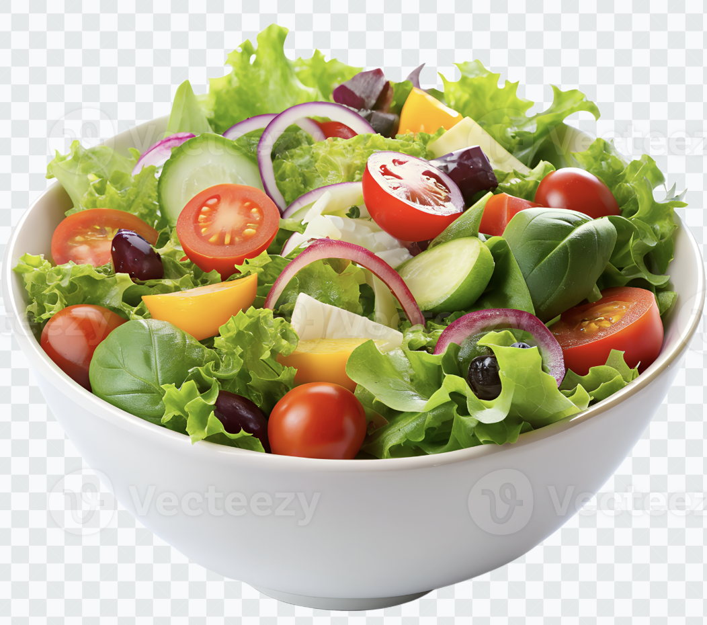

# Compatibility
- Use this explicitly when user ask for indian, mexican or mediterranean style salad. Don't try infer anything from this skill if user ask in another style.
- Avoid locaiton, region infer from this skill.
- you are free suggest general recepie form your existing knowledge.

# Step 1
- Makse sure which type of salad user wants
- For indian use this [Indian style salad](./references/indian-style.md)
- For mexican use this [Mexican style salad](./references/mexican-style.md)
- For mediterranean use this [Mediterranean style salad](./references/mediterranean-style.md)

# Step 2
- Once the salad is ready, you can call python script to have celeberating voice.
- Whaterver the program return will be celeberation word, you should say or print like, Your salas is saying {return value from python script}

# Step 3
- When you give salad recipe, give heading that here is your {use_requested_salad} then inject the salad image inline using markdown image syntax: 
- Eg. Here is you tasty Indian salad 

